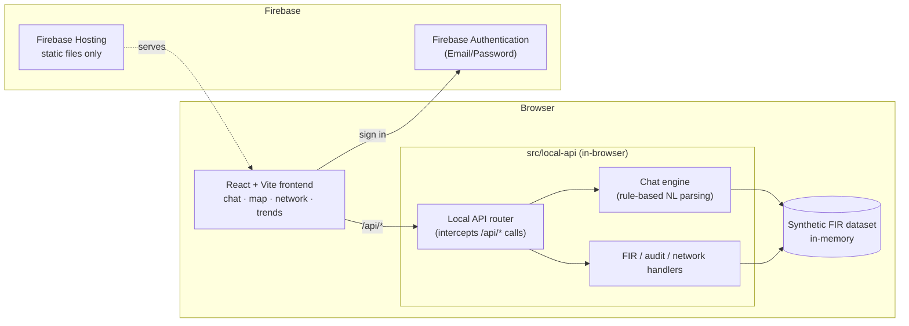

<div align="center">

# 🛡️ SCRB Sanket

### AI-powered conversational crime intelligence for the Karnataka State Crime Records Bureau

<p>
  
  
  
</p>

<p>
  
  
  
  
  
  
</p>

> ⚠️ **Demo environment — synthetic data only, no real case records.**
> Nothing in this repo touches real CCTNS/SCRB data, real names, or real ongoing investigations.

### 🔗 [**Live Demo →**](https://scrb-sanket.web.app) &nbsp;·&nbsp; [**GitHub Repo →**](https://github.com/Naxt318/SCRB-Sanket)

</div>

<br>

## 📖 Table of contents

- [What is this?](#-what-is-this)
- [Features](#-features)
- [The dataset](#-the-dataset)
- [Architecture](#-architecture)
- [Tech stack](#-tech-stack)
- [Getting started](#-getting-started)
- [Deployment](#-deployment)
- [Project structure](#-project-structure)
- [Compliance & disclaimers](#-compliance--disclaimers)

<br>

## 🎯 What is this?

Investigators across Karnataka's **1,100+ police stations** currently rely
on static dashboards to make sense of crime data. **SCRB Sanket** is a
prototype of what that workflow could look like instead: ask a question in
plain language, and get back a structured answer with the chart, map, or
network graph that actually explains it — plus a visible trail of *how*
the system got there.

It's built as a command-center tool, not a consumer chatbot: role-gated
access, an audit trail on every answer, and a synthetic dataset that
stands in for real records so the prototype can be demoed safely.

<br>

## ✨ Features

<table>
<tr>
<td width="60px" align="center">💬</td>
<td><b>Conversational query interface</b><br>Ask things like <i>"show me chain snatching cases in Bengaluru in the last 3 months"</i> and get a direct answer plus supporting chart or map. Follow-up questions ("now break that down by time of day") keep context automatically.</td>
</tr>
<tr>
<td align="center">🗺️</td>
<td><b>Crime hotspot map</b><br>District-level density view, filterable by crime type and date range.</td>
</tr>
<tr>
<td align="center">🕸️</td>
<td><b>Criminal network analysis</b><br>Force-directed graph linking persons of interest across cases — shared MO, co-accused, shared location. Click a node to see connected case summaries.</td>
</tr>
<tr>
<td align="center">📈</td>
<td><b>Trend & early-warning panel</b><br>Time-series view flagging districts with rising crime-type trends.</td>
</tr>
<tr>
<td align="center">🔍</td>
<td><b>Explainable AI & audit trail</b><br>Every answer shows its reasoning steps and the records it drew on, plus a persistent, reviewable query log.</td>
</tr>
<tr>
<td align="center">🔐</td>
<td><b>Role-based access</b><br>Investigator / Supervisor / Admin roles gate the audit trail and network-analysis tools to the people who should see them.</td>
</tr>
<tr>
<td align="center">🎙️</td>
<td><b>Voice input</b><br>Mic-driven queries for hands-free use.</td>
</tr>
<tr>
<td align="center">📄</td>
<td><b>PDF export</b><br>Export a conversation thread as a formatted report.</td>
</tr>
</table>

<br>

## 🗂️ The dataset

All data is **100% synthetic** — generated FIR-style records with no
connection to real cases, investigations, or people.

<table>
<tr><td>🏙️ <b>Districts</b></td><td>Bengaluru Urban · Mysuru · Dakshina Kannada · Tumakuru · Belagavi</td></tr>
<tr><td>🚨 <b>Crime categories</b></td><td>Chain Snatching · Theft · Cybercrime · Narcotics · Assault · Burglary · Vehicle Theft · Fraud · Robbery · Domestic Violence</td></tr>
<tr><td>🧾 <b>Record fields</b></td><td>Timestamps, approximate geo-coordinates, anonymized person-of-interest linkage IDs</td></tr>
</table>

> The chat engine is **rule-based and deterministic** — it parses the
> query, matches it against this dataset, and returns an answer with its
> reasoning shown. No external AI API calls are made to answer questions,
> which keeps the demo self-contained and auditable by design.

<br>

## 🏗️ Architecture



There's no backend server or Cloud Function — every "/api/*" call is
answered inside the browser by `src/local-api/`, which is why this runs
on Firebase's free **Spark** plan.

<br>

## 🧰 Tech stack

| Layer | Tools |
|---|---|
| **Frontend** | React · Vite · Tailwind CSS · Recharts · Leaflet · `react-force-graph` · `wouter` |
| **"Backend"** | Plain TypeScript running in the browser (`src/local-api/`) — no server |
| **Auth** | Firebase Authentication (Email/Password) |
| **Monorepo** | pnpm workspaces · TypeScript throughout |

<br>

## 🚀 Getting started

**Just want to try it?** → **[scrb-sanket.web.app](https://scrb-sanket.web.app)** — log in with any of the three demo accounts listed in [`FIREBASE-DEPLOY.md`](./FIREBASE-DEPLOY.md#one-time-setup).

**Want to run it locally / contribute?**

```bash
cp artifacts/scrb-sanket/.env.example artifacts/scrb-sanket/.env
# fill in your Firebase project's web config, see FIREBASE-DEPLOY.md
pnpm install
pnpm dev
```

| Environment | URL |
|---|---|
| 🌐 Live (Firebase Hosting) | [scrb-sanket.web.app](https://scrb-sanket.web.app) |
| 🖥️ Local dev (no separate API process needed) | `http://localhost:26259` |

📘 See **[`FIREBASE-DEPLOY.md`](./FIREBASE-DEPLOY.md)** for full setup —
creating a Firebase project, enabling Email/Password sign-in, creating the
demo accounts, and deploying.

<br>

## ☁️ Deployment

Since the app is fully static (no server, no database), it can be hosted
on either of these — pick whichever is easier for you:

| Host | Command | Notes |
|---|---|---|
| **Firebase Hosting** | `firebase deploy --only hosting` | Also hosts Firebase Authentication for login. See `FIREBASE-DEPLOY.md`. |
| **Vercel** | `git push` (auto-deploys) | Uses the `vercel.json` at the repo root. Add the six `VITE_FIREBASE_*` variables under Project Settings → Environment Variables so login still works. |

Both point at the same build output
(`artifacts/scrb-sanket/dist/public`) and the same Firebase project for
auth — you can even run both at once and share whichever link is more
convenient.

<br>

## 📁 Project structure

```
artifacts/
  scrb-sanket/       # React + Vite frontend
    src/local-api/   # Chat engine, synthetic dataset, local /api/* router
  mockup-sandbox/    # Component design sandbox
lib/
  api-spec/          # API contract
  api-zod/           # Generated Zod validators
  api-client-react/  # Generated typed API client (with a local-handler hook)
```

<br>

## 🛡️ Compliance & disclaimers

A persistent in-app banner marks this as a demo environment running on
synthetic data only. A dedicated panel outlines how a production
deployment would need to handle real crime data under the **DPDP Act,
2023** — encryption at rest, access logging, and data minimization.

<br>

<div align="center">

*Built as a prototype — official, trustworthy, command-center feel.*

</div>
