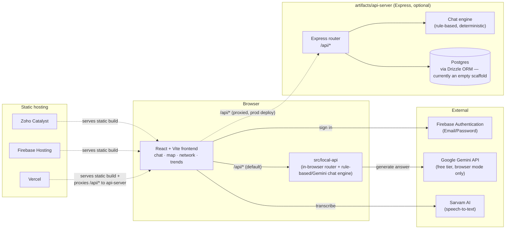

<div align="center">


# 🛡️ SCRB Sanket

### AI-powered conversational crime intelligence for the Karnataka State Crime Records Bureau

<p>
  
  
  
</p>

<p>
  
  
  
  
  
  
  
  
  
</p>

> ⚠️ **Demo environment — synthetic data only, no real case records.**
> Nothing in this repo touches real CCTNS/SCRB data, real names, logos, signs or real ongoing investigations.

### 🔗 [**Live Demo →**](https://scrb-sanket-60080213548.development.catalystserverless.in/app/) &nbsp;·&nbsp; [**GitHub Repo →**](https://github.com/Naxt318/SCRB-Sanket)

</div>

<br>

## 📖 Table of contents

- [What is this?](#-what-is-this)
- [Features](#-features)
- [The dataset](#-the-dataset)
- [Architecture](#-architecture)
- [Tech stack](#-tech-stack)
- [Getting started](#-getting-started)
- [Deployment](#-deployment)
- [Project structure](#-project-structure)
- [Compliance & disclaimers](#-compliance--disclaimers)

<br>

## 🎯 What is this?

Investigators across Karnataka's **1,100+ police stations** currently rely
on static dashboards to make sense of crime data. **SCRB Sanket** is a
prototype of what that workflow could look like instead: ask a question in
plain language, and get back a structured answer with the chart, map, or
network graph that actually explains it — plus a visible trail of *how*
the system got there.

It's built as a command-center tool, not a consumer chatbot: role-gated
access, an audit trail on every answer, and a synthetic dataset that
stands in for real records so the prototype can be demoed safely.

<br>

## ✨ Features

<table>
<tr>
<td width="60px" align="center">💬</td>
<td><b>Conversational query interface</b><br>Ask things like <i>"show me chain snatching cases in Bengaluru in the last 3 months"</i> and get a direct answer plus supporting chart or map. Follow-up questions ("now break that down by time of day") keep context automatically.</td>
</tr>
<tr>
<td align="center">🗺️</td>
<td><b>Crime hotspot map</b><br>District-level density view, filterable by crime type and date range.</td>
</tr>
<tr>
<td align="center">🕸️</td>
<td><b>Criminal network analysis</b><br>Force-directed graph linking persons of interest across cases — shared MO, co-accused, shared location. Click a node to see connected case summaries.</td>
</tr>
<tr>
<td align="center">📈</td>
<td><b>Trend & early-warning panel</b><br>Time-series view flagging districts with rising crime-type trends.</td>
</tr>
<tr>
<td align="center">🔍</td>
<td><b>Explainable AI & audit trail</b><br>Every answer shows its reasoning steps and the records it drew on, plus a persistent, reviewable query log.</td>
</tr>
<tr>
<td align="center">🔐</td>
<td><b>Role-based access</b><br>Investigator / Supervisor / Admin roles gate the audit trail and network-analysis tools to the people who should see them.</td>
</tr>
<tr>
<td align="center">🎙️</td>
<td><b>Voice input</b><br>Mic-driven queries for hands-free use, transcribed via Sarvam AI speech-to-text.</td>
</tr>
<tr>
<td align="center">📄</td>
<td><b>PDF export</b><br>Export a conversation thread as a formatted report.</td>
</tr>
</table>

<br>

## 🗂️ The dataset

All data is **100% synthetic** — generated FIR-style records with no
connection to real cases, investigations, or people.

<table>
<tr><td>🏙️ <b>Districts</b></td><td>Bengaluru Urban · Mysuru · Dakshina Kannada · Tumakuru · Belagavi</td></tr>
<tr><td>🚨 <b>Crime categories</b></td><td>Chain Snatching · Theft · Cybercrime · Narcotics · Assault · Burglary · Vehicle Theft · Fraud · Robbery · Domestic Violence</td></tr>
<tr><td>🧾 <b>Record fields</b></td><td>Timestamps, approximate geo-coordinates, anonymized person-of-interest linkage IDs</td></tr>
</table>

> The chat engine grounds every answer in this synthetic dataset first —
> filtering and reasoning over it deterministically. In the browser
> (zero-backend) build, it then uses Google Gemini (free tier) to phrase
> the final natural-language response, falling back to a rule-based
> answer automatically if the AI call is unavailable. The Express
> `api-server` build currently answers with the rule-based engine only.

<br>

## 🏗️ Architecture

The frontend always talks to relative `/api/*` URLs, but where those calls
actually get answered depends on how the app is deployed. Two backends
ship in this repo and implement the same routes (auth, chat, FIRs, audit,
network):



**Zero-backend mode (default wiring):** `src/main.tsx` registers the
in-browser handler from `src/local-api/` for every `/api/*` call, so the
static build works standalone on a free static host (Zoho Catalyst, or
Firebase Hosting on the Spark plan) with no server to run or pay for. This
is the mode the [live demo](#-getting-started) runs in, and it's the only
place the Gemini AI integration lives.

**Persistent-backend mode:** `artifacts/api-server` is a standalone
Express 5 app with the same route surface, wired for a real Postgres
database via Drizzle ORM (the schema is currently an empty scaffold — all
records still come from the synthetic in-memory dataset). It's meant to
be deployed separately as a long-running Node process (Render, Railway,
Fly.io), with the Vite frontend deployed to **Vercel** and a small edge
function (`api/[...path].ts`) proxying `/api/*` to it — see
[`DEPLOY.md`](./DEPLOY.md). A Firebase Cloud Functions wrapper for the
same Express app also exists at `firebase/functions/`.

<br>

## 🧰 Tech stack

| Layer | Tools |
|---|---|
| **Frontend** | React 19 · Vite · Tailwind CSS · Recharts · Leaflet · `react-force-graph` · `wouter` |
| **Zero-backend mode** | Plain TypeScript running in the browser (`src/local-api/`) — no server |
| **Persistent-backend mode** | Express 5 (`artifacts/api-server`) · Postgres via Drizzle ORM (`lib/db`) · Zod-validated API contract (`lib/api-spec`, `lib/api-zod`) |
| **Auth** | Firebase Authentication (Email/Password) |
| **AI** | Google Gemini API (chat answers, browser mode) · Sarvam AI (voice transcription) |
| **Hosting** | Zoho Catalyst or Firebase Hosting (static build) · Vercel (frontend, persistent-backend mode) + Render/Railway/Fly.io or Firebase Cloud Functions (API server) |
| **Monorepo** | pnpm workspaces · TypeScript throughout |

<br>

## 🚀 Getting started

**[Try the live demo →](https://scrb-sanket-60080213548.development.catalystserverless.in/app/)**
(the zero-backend build, running on Zoho Catalyst)

📘 See **[`Credentials.md`](./Credentials.md)** for demo login ID and password.

Want to run it on your own machine instead? See
**[`RUN-LOCALLY.md`](./RUN-LOCALLY.md)** — it covers installing
dependencies, environment variables for both the frontend and the API
server, and running everything with `pnpm dev`.

<br>

## ☁️ Deployment

Pick whichever mode fits:

**Zero-backend (static hosting only)** — the simplest path, no database
or long-running server required:

```bash
npm install -g zcatalyst-cli
catalyst login
catalyst init            # link this folder to your Catalyst project (Client only)
pnpm --filter @workspace/scrb-sanket run build
catalyst deploy --only client        # deploys to the Development environment
catalyst deploy --only client --prod # promotes to Production
```

Catalyst deploys to a Development environment first; use the `--prod`
flag (or the "Migrate to Production" option in the console) to make a
build publicly reachable. `firebase.json` is also configured if you'd
rather deploy the same static build to Firebase Hosting.

Firebase Authentication is used for login regardless of where the static
files are hosted — set the six `VITE_FIREBASE_*` variables in your `.env`,
plus `VITE_GEMINI_API_KEY` and `VITE_SARVAM_API_KEY` for the AI chat and
voice features.

**Persistent backend (Vercel + a Node host)** — for a deployment backed
by a real Express API and Postgres instead of the in-browser router:

1. Deploy `artifacts/api-server` to a host that runs a persistent Node
   process (Render, Railway, Fly.io), pointed at a reachable Postgres
   database.
2. Deploy the repo to Vercel — `vercel.json` builds just the frontend
   package, and the `api/[...path].ts` edge function proxies `/api/*`
   requests to the API server via one `API_ORIGIN` environment variable.

Full step-by-step instructions, including troubleshooting, are in
**[`DEPLOY.md`](./DEPLOY.md)**. A Firebase Cloud Functions wrapper for the
same Express app is also available under `firebase/functions/` as another
way to host the persistent backend.

<br>

## 📁 Project structure

```
artifacts/
  scrb-sanket/       # React + Vite frontend
    src/local-api/   # Chat engine (rule-based + Gemini), synthetic dataset,
                     #   in-browser /api/* router — zero-backend mode
  api-server/        # Express 5 API server — persistent-backend mode
    src/routes/      # auth · chat · firs · audit · network · meta · health
    src/lib/         # rule-based chat engine, session store, logger
    src/data/        # synthetic FIR dataset
  mockup-sandbox/    # Component design sandbox
lib/
  api-spec/          # API contract
  api-zod/           # Generated Zod validators
  api-client-react/  # Generated typed API client (with a local-handler hook)
  db/                # Drizzle ORM schema (currently an empty scaffold) + client
firebase/
  functions/         # Firebase Cloud Functions wrapper around the same Express app
api/
  [...path].ts       # Vercel edge function proxying /api/* to the deployed api-server
```

<br>

## 🛡️ Compliance & disclaimers

A persistent in-app banner marks this as a demo environment running on
synthetic data only. A dedicated panel outlines how a production
deployment would need to handle real crime data under the **DPDP Act,
2023** — encryption at rest, access logging, and data minimization.

<br>

<div align="center">

*Built as a prototype — official, trustworthy, command-center feel.*

</div>
