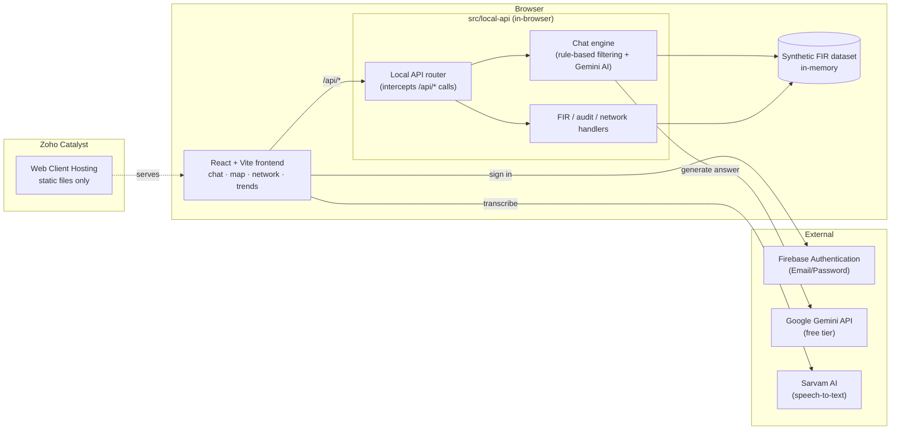

<div align="center">


<br><br>

# 🛡️ S C R B &nbsp; S A N K E T

<h3><i>Ask your crime data a question.<br>Get back the answer — and the trail that proves it.</i></h3>

<p><b>AI-powered conversational crime intelligence for the Karnataka State Crime Records Bureau</b></p>

<br>

<p>
  
  
  
  
</p>

<p>
  
  
  
  
  
  
  
  
  
</p>

<br>

</div>

> [!WARNING]
> **Demo environment — synthetic data only, no real case records.**
> Nothing in this repo touches real CCTNS/SCRB data, real names, logos, signs or real ongoing investigations.

<div align="center">

<br>

### 🔗 [**LIVE DEMO**](https://scrb-sanket-60080213548.development.catalystserverless.in/app/) &nbsp;&nbsp;·&nbsp;&nbsp; 💻 [**GITHUB REPO**](https://github.com/Naxt318/SCRB-Sanket) &nbsp;&nbsp;·&nbsp;&nbsp; 🔑 [**DEMO CREDENTIALS**](./Credentials.md)

<br>

╔═══════════════════════════════════════════════════════════════╗

**"Show me chain snatching cases in Bengaluru, last 3 months"**
*→ instant answer, chart, and a full reasoning trail*

╚═══════════════════════════════════════════════════════════════╝

</div>

<br>

<div align="center">

| 🏙️ 5 Districts | 🚨 10 Crime Types | 🕸️ Network Graphs | 🔐 3 Access Roles | 🎙️ Voice Input |
|:---:|:---:|:---:|:---:|:---:|

</div>

<br>

---

<br>

## 📖 Table of contents

<table>
<tr>
<td valign="top" width="50%">

- [🎯 What is this?](#-what-is-this)
- [✨ Features](#-features)
- [🗂️ The dataset](#️-the-dataset)
- [🏗️ Architecture](#️-architecture)

</td>
<td valign="top" width="50%">

- [🧰 Tech stack](#-tech-stack)
- [🚀 Getting started](#-getting-started)
- [☁️ Deployment](#️-deployment)
- [📁 Project structure](#-project-structure)
- [🛡️ Compliance & disclaimers](#️-compliance--disclaimers)

</td>
</tr>
</table>

<br>

---

<br>

## 🎯 What is this?

> Investigators across Karnataka's **1,100+ police stations** currently rely on static dashboards to make sense of crime data.

**SCRB Sanket** *(ಸಂಕೇತ — "signal" / "code")* is a prototype of what that workflow could look like instead: ask a question in plain language, and get back a structured answer with the chart, map, or network graph that actually explains it — plus a visible trail of *how* the system got there.

<br>

<table>
<tr>
<td width="33%" align="center" valign="top">
<h3>🎙️</h3>
<b>Ask naturally</b>
<br><br>
<i>"Chain snatching cases in Bengaluru, last 3 months?"</i>
</td>
<td width="33%" align="center" valign="top">
<h3>🧠</h3>
<b>Reasoned, not guessed</b>
<br><br>
Every answer is grounded in the dataset first, then explained step by step
</td>
<td width="33%" align="center" valign="top">
<h3>🔐</h3>
<b>Built for a command center</b>
<br><br>
Role-gated, audit-logged, and demoed safely on synthetic data
</td>
</tr>
</table>

<br>

---

<br>

## ✨ Features

<table>
<tr>
<td width="60px" align="center">💬</td>
<td><b>Conversational query interface</b><br>Ask things like <i>"show me chain snatching cases in Bengaluru in the last 3 months"</i> and get a direct answer plus supporting chart or map. Follow-up questions ("now break that down by time of day") keep context automatically.</td>
</tr>
<tr>
<td align="center">🗺️</td>
<td><b>Crime hotspot map</b><br>District-level density view, filterable by crime type and date range.</td>
</tr>
<tr>
<td align="center">🕸️</td>
<td><b>Criminal network analysis</b><br>Force-directed graph linking persons of interest across cases — shared MO, co-accused, shared location. Click a node to see connected case summaries.</td>
</tr>
<tr>
<td align="center">📈</td>
<td><b>Trend & early-warning panel</b><br>Time-series view flagging districts with rising crime-type trends.</td>
</tr>
<tr>
<td align="center">🔍</td>
<td><b>Explainable AI & audit trail</b><br>Every answer shows its reasoning steps and the records it drew on, plus a persistent, reviewable query log.</td>
</tr>
<tr>
<td align="center">🔐</td>
<td><b>Role-based access</b><br>Investigator / Supervisor / Admin roles gate the audit trail and network-analysis tools to the people who should see them.</td>
</tr>
<tr>
<td align="center">🎙️</td>
<td><b>Voice input</b><br>Mic-driven queries for hands-free use, transcribed via Sarvam AI speech-to-text.</td>
</tr>
<tr>
<td align="center">📄</td>
<td><b>PDF export</b><br>Export a conversation thread as a formatted report.</td>
</tr>
</table>

<br>

---

<br>

## 🗂️ The dataset

<div align="center">

**🧪 All data is 100% synthetic** — generated FIR-style records with zero connection to real cases, investigations, or people.

</div>

<br>

<table>
<tr><td>🏙️&nbsp;&nbsp;<b>Districts</b></td><td>Bengaluru Urban · Mysuru · Dakshina Kannada · Tumakuru · Belagavi</td></tr>
<tr><td>🚨&nbsp;&nbsp;<b>Crime categories</b></td><td>Chain Snatching · Theft · Cybercrime · Narcotics · Assault · Burglary · Vehicle Theft · Fraud · Robbery · Domestic Violence</td></tr>
<tr><td>🧾&nbsp;&nbsp;<b>Record fields</b></td><td>Timestamps, approximate geo-coordinates, anonymized person-of-interest linkage IDs</td></tr>
</table>

<br>

> [!TIP]
> The chat engine grounds every answer in this synthetic dataset first — filtering and reasoning over it deterministically — then uses **Google Gemini** (free tier) to phrase the final natural-language response, falling back to a rule-based answer automatically if the AI call is unavailable.

<br>

---

<br>

## 🏗️ Architecture



<div align="center">

### 🚫 No backend server &nbsp;·&nbsp; 🚫 No Cloud Function &nbsp;·&nbsp; 🚫 No database

</div>

<br>

Every `/api/*` call is answered inside the browser by `src/local-api/`. The only external calls are to Firebase (auth), Google Gemini (chat answers), and Sarvam AI (voice transcription) — all reachable directly from the browser, which is why this can run entirely on free tiers.

<br>

<details>
<summary><b>🔍 Why build it this way?</b></summary>
<br>

A real deployment behind SCRB's own infrastructure would obviously sit behind a proper backend and a real database. For a hackathon prototype, though, every extra moving part is one more thing that can go wrong on demo day — so the "backend" here is just deterministic TypeScript running in the visitor's own browser, backed by a synthetic dataset. Zero infra to keep alive, zero hosting cost, and the exact same user-facing behavior a real backend would produce.

</details>

<br>

---

<br>

## 🧰 Tech stack

| Layer | Tools |
|---|---|
| 🎨 **Frontend** | React 19 · Vite · Tailwind CSS · Recharts · Leaflet · `react-force-graph` · `wouter` |
| ⚙️ **"Backend"** | Plain TypeScript running in the browser (`src/local-api/`) — no server |
| 🔑 **Auth** | Firebase Authentication (Email/Password) |
| 🤖 **AI** | Google Gemini API (chat answers) · Sarvam AI (voice transcription) |
| ☁️ **Hosting** | Zoho Catalyst — Web Client Hosting |
| 📦 **Monorepo** | pnpm workspaces · TypeScript throughout |

<br>

---

<br>

## 🚀 Getting started

<div align="center">

### **[▶️ TRY THE LIVE DEMO](https://scrb-sanket-60080213548.development.catalystserverless.in/app/)**

📘 See **[`Credentials.md`](./Credentials.md)** for demo login ID and password.

</div>

<br>

Want to run it on your own machine instead? See **[`RUN-LOCALLY.md`](./RUN-LOCALLY.md)**.

<br>

---

<br>

## ☁️ Deployment

The app is fully static (no server, no database) and is hosted on **Zoho Catalyst's Web Client Hosting**.

```bash
npm install -g zcatalyst-cli
catalyst login
catalyst init            # link this folder to your Catalyst project (Client only)
pnpm --filter @workspace/scrb-sanket run build
catalyst deploy --only client        # deploys to the Development environment
catalyst deploy --only client --prod # promotes to Production
```

Catalyst deploys to a Development environment first; use the `--prod` flag (or the "Migrate to Production" option in the console) to make a build publicly reachable.

Firebase Authentication is still used for login regardless of where the static files are hosted — set the six `VITE_FIREBASE_*` variables in your `.env` (see [`RUN-LOCALLY.md`](./RUN-LOCALLY.md) for where to get them), plus `VITE_GEMINI_API_KEY` and `VITE_SARVAM_API_KEY` for the AI chat and voice features.

<br>

---

<br>

## 📁 Project structure

```
artifacts/
  scrb-sanket/       # React + Vite frontend
    src/local-api/   # Chat engine, synthetic dataset, local /api/* router
  mockup-sandbox/    # Component design sandbox
lib/
  api-spec/          # API contract
  api-zod/           # Generated Zod validators
  api-client-react/  # Generated typed API client (with a local-handler hook)
```

<br>

---

<br>

## 🛡️ Compliance & disclaimers

A persistent in-app banner marks this as a demo environment running on synthetic data only. A dedicated panel outlines how a production deployment would need to handle real crime data under the **DPDP Act, 2023** — encryption at rest, access logging, and data minimization.

<br>

<div align="center">

---

<br>

### *Built as a prototype — official, trustworthy, command-center feel.* 🛡️

<sub>Made for the Karnataka State Crime Records Bureau &nbsp;·&nbsp; Synthetic data only &nbsp;·&nbsp; MIT Licensed</sub>

<br><br>


</div>
